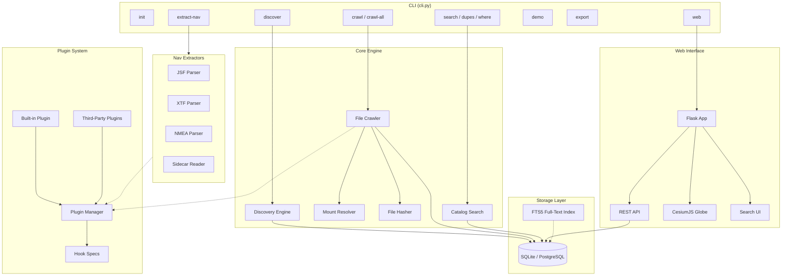
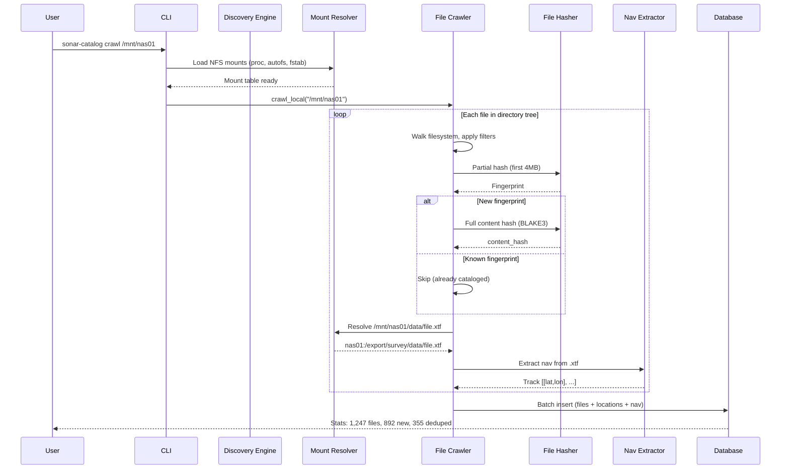
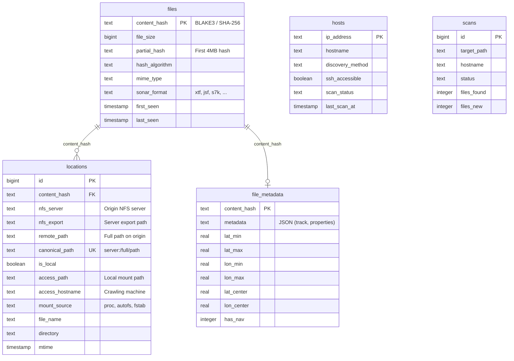
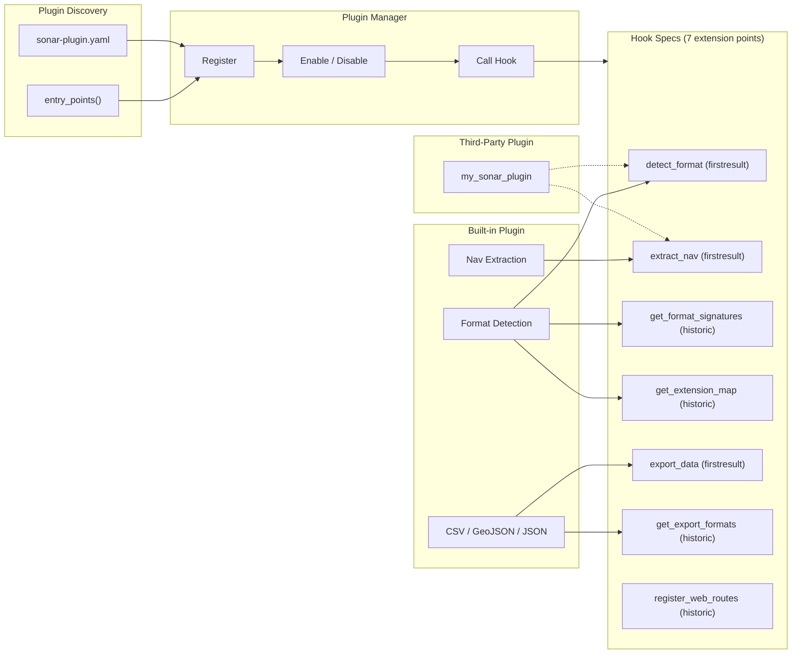
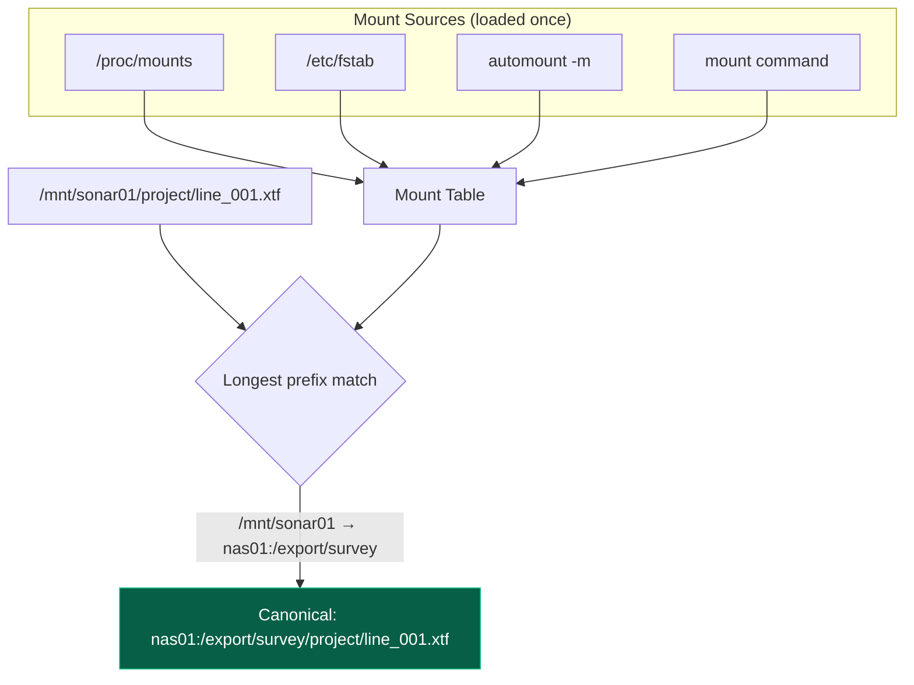
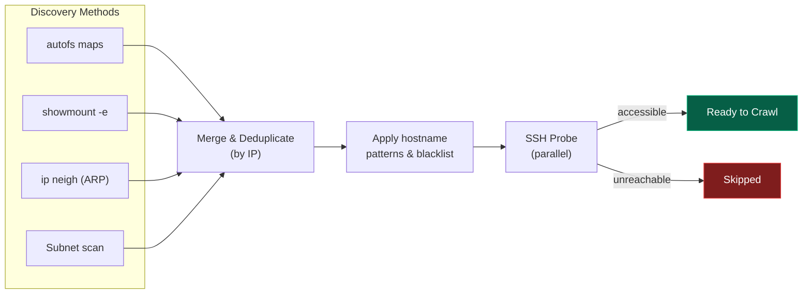
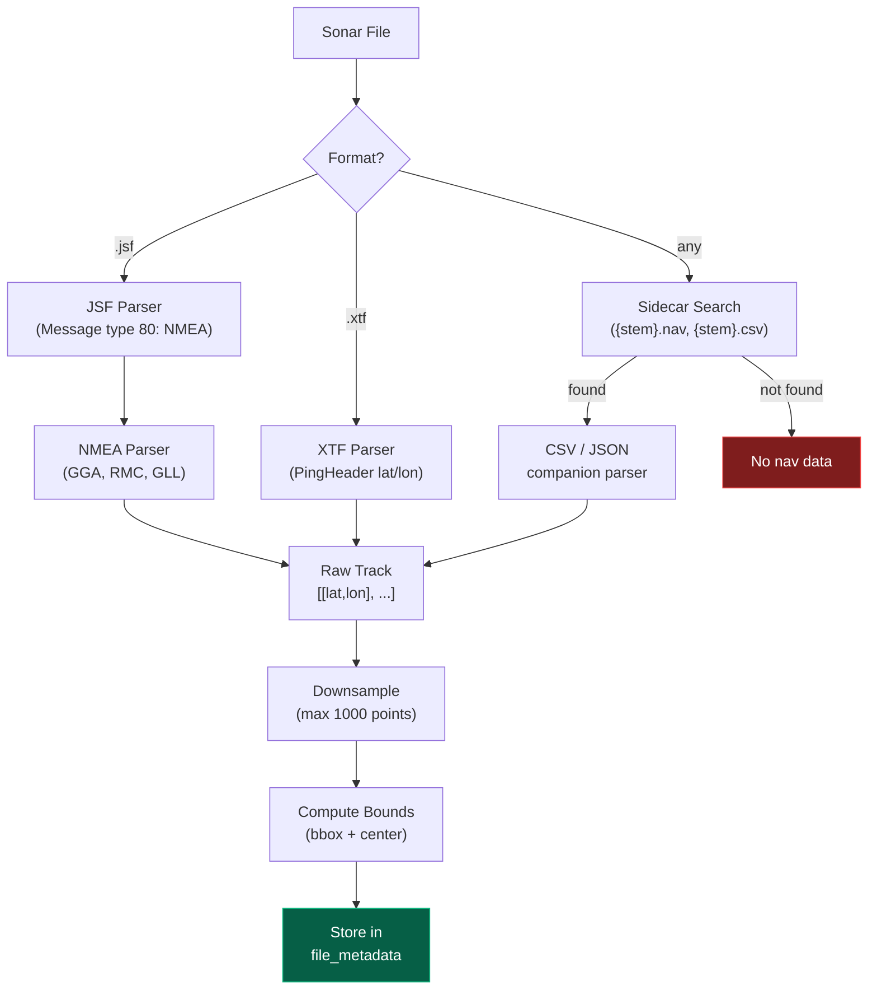
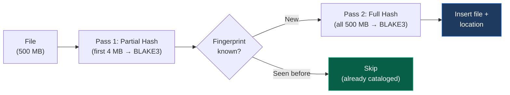
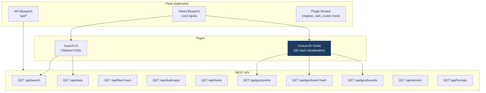

# Sonar Catalog

Petabyte-scale sonar file catalog with content-based deduplication across distributed NFS systems. Automatically discovers hosts, resolves NFS mount topologies, crawls filesystems, extracts navigation tracks, and serves everything through a searchable web UI with a CesiumJS 3D globe.

```
sonar-catalog init
sonar-catalog crawl /mnt/sonar-nas-01
sonar-catalog web
```

---

## Architecture



---

## Data Flow

How a file goes from disk to searchable catalog entry:



---

## Database Schema



**Key concept:** No data is copied. The catalog stores *pointers*. If the same file appears on 10 NFS servers, there is **one row in `files`** and **10 rows in `locations`**, each pointing back to its canonical NFS origin.

---

## Plugin Architecture

Inspired by [napari](https://github.com/napari/napari)'s plugin system. All built-in functionality (format detection, nav extraction, export) is registered through the same hook system that third-party plugins use.



### Hook Modes

| Mode | Behavior | Example |
|---|---|---|
| **firstresult** | First plugin to return non-`None` wins (short-circuits) | Format detection, nav extraction |
| **historic** | All plugins contribute results (collected into a list) | Signature registration, export formats |

### Writing a Plugin

Create a Python package with an entry point:

```toml
# pyproject.toml
[project.entry-points."sonar_catalog.plugins"]
my_plugin = "my_sonar_plugin"
```

```python
# my_sonar_plugin/__init__.py
def register(manager):
    manager.register_plugin(
        name="my-plugin",
        version="1.0.0",
        description="Adds FooBar sonar format support",
    )

    manager.register_hook_impl(
        "detect_format", "my-plugin", detect_foobar
    )
    manager.register_hook_impl(
        "extract_nav", "my-plugin", extract_foobar_nav
    )


def detect_foobar(file_path=None, header=None, extension=None, **kw):
    if header and header[:4] == b"\xFO\x0B\xAR":
        return "foobar"
    return None


def extract_foobar_nav(file_path=None, sonar_format=None, **kw):
    if sonar_format != "foobar":
        return None
    # ... parse binary nav data ...
    from sonar_catalog.extractors.base import NavResult
    return NavResult(track=[[56.0, 3.0], [56.1, 3.1]], source="foobar_nav")
```

Or use a YAML manifest instead of code:

```yaml
# sonar-plugin.yaml
name: my-sonar-plugin
version: 1.0.0
contributions:
  formats:
    - name: foobar
      extensions: [".fb", ".fbar"]
      magic_bytes: "f00bar"
      magic_offset: 0
  nav_extractors:
    - format: foobar
      python_name: my_package.extractors:FooBarExtractor
```

---

## NFS Mount Resolution

The mount resolver determines the canonical origin of every file by cross-referencing multiple mount sources:



This means the same file accessed from different machines (different local mount points) resolves to the same canonical path, enabling cross-machine deduplication.

---

## Host Discovery



---

## Nav Extraction Pipeline



---

## Two-Pass Deduplication

The hasher uses a two-pass strategy to minimize I/O on large files:



For a typical NFS share with 80% unchanged files, this skips reading ~80% of bytes on incremental scans.

---

## Web Interface



The globe view renders file locations as color-coded markers (by sonar format) on a 3D CesiumJS globe. Clicking a marker loads and displays the navigation track as a polyline.

---

## Supported Sonar Formats

| Format | Extensions | Detection | Nav Extraction |
|---|---|---|---|
| XTF (eXtended Triton Format) | `.xtf` | Magic bytes `0x0100` | PingHeader lat/lon fields |
| JSF (EdgeTech) | `.jsf` | Magic bytes `0x1616` | NMEA from message type 80 |
| Kongsberg .all | `.all` | Magic bytes `0x49` | - |
| Kongsberg KMALL | `.kmall` | Magic bytes `0x4B4D` | - |
| Reson S7K | `.s7k` | Extension | - |
| BAG (Bathymetric Attributed Grid) | `.bag` | Extension | - |
| SEG-Y | `.sgy`, `.segy` | Extension | - |
| Humminbird | `.db` | Extension | - |
| Lowrance | `.sl2`, `.sl3` | Extension | - |
| Raw | `.raw` | Extension | - |
| Custom | configurable | Magic bytes + extension | Via plugin |

Add custom formats at runtime:
```bash
sonar-catalog add-magic-byte sample.myformat --format-name my_sonar --length 4
```

---

## Installation

```bash
# Minimal (SQLite only, no external dependencies)
pip install .

# With all optional features
pip install ".[all]"

# Individual extras
pip install ".[web]"       # Flask web UI + CesiumJS globe
pip install ".[blake3]"    # BLAKE3 hashing (faster than SHA-256)
pip install ".[postgres]"  # PostgreSQL backend
pip install ".[magic]"     # python-magic MIME detection

# Development
pip install -e ".[dev,all]"
```

Zero required dependencies. The core runs on Python 3.10+ stdlib only (sqlite3, hashlib, subprocess, socket).

---

## Quick Start

```bash
# Initialize the database
sonar-catalog init

# Option A: Crawl a real NFS mount
sonar-catalog crawl /mnt/sonar-nas-01

# Option B: Load synthetic demo data (no real sonar files needed)
sonar-catalog demo --num-files 100

# Extract navigation tracks from cataloged files
sonar-catalog extract-nav

# Explore
sonar-catalog stats
sonar-catalog search "line_001"
sonar-catalog dupes
sonar-catalog where <content_hash>

# Start the web UI
sonar-catalog web --port 8080
# Open http://localhost:8080        (search)
# Open http://localhost:8080/globe  (3D globe)
```

### Auto-Discovery Mode

```bash
# Discover all NFS hosts on the network, then crawl everything
sonar-catalog discover --deep
sonar-catalog crawl-all
```

---

## CLI Reference

| Command | Description |
|---|---|
| `init` | Initialize database and config |
| `discover` | Discover NFS hosts and mounts on the network |
| `crawl <path>` | Crawl and catalog a directory |
| `crawl-all` | Discover and crawl all accessible hosts |
| `search` | Search the catalog (supports FTS5) |
| `dupes` | Find duplicate files across servers |
| `where <hash>` | Show all locations for a file by content hash |
| `stats` | Show catalog statistics |
| `hosts` | List discovered hosts |
| `extract-nav` | Extract navigation data from cataloged sonar files |
| `export` | Export data to CSV, GeoJSON, or JSON |
| `demo` | Load synthetic demo data for exploring the UI |
| `plugins list` | List installed plugins and their hooks |
| `plugins enable/disable <name>` | Enable or disable a plugin |
| `add-magic-byte <file>` | Learn a new format's magic bytes from a sample file |
| `list-magic-bytes` | Show all registered magic byte signatures |
| `rebuild-index` | Rebuild the FTS5 search index |
| `config` | Show current configuration as JSON |
| `web` | Start the Flask web interface |

---

## Configuration

Configuration lives at `~/.config/sonar-catalog/config.json`. All fields are optional — defaults work out of the box.

```json
{
  "database": {
    "backend": "sqlite",
    "sqlite_path": "~/.local/share/sonar-catalog/catalog.db"
  },
  "discovery": {
    "ssh_user": "survey",
    "ssh_timeout": 3,
    "hostname_patterns": ["sonar-*", "nas-*"],
    "use_autofs": true,
    "use_showmount": true
  },
  "crawler": {
    "hash_algorithm": "blake3",
    "partial_hash_size": 4194304,
    "hash_workers": 4,
    "batch_size": 1000,
    "incremental": true
  },
  "metadata": {
    "sonar_extensions": [".xtf", ".jsf", ".s7k", ".all", ".kmall", ".bag"],
    "nav_extraction": {
      "enabled": true,
      "max_track_points": 1000,
      "sidecar_patterns": [
        {
          "pattern": "{stem}.nav",
          "format": "csv",
          "lat_field": "lat",
          "lon_field": "lon"
        }
      ]
    }
  },
  "plugins": {
    "disabled_plugins": []
  }
}
```

---

## Project Structure

```
sonar_catalog/
    __init__.py
    cli.py                 # CLI entry point (18 subcommands)
    config.py              # Dataclass-based configuration
    database.py            # SQLite + PostgreSQL dual backend
    search.py              # FTS5-powered search engine
    crawler.py             # Filesystem walker + batch processor
    hasher.py              # Two-pass BLAKE3/SHA-256 deduplication
    discovery.py           # Network host + NFS mount discovery
    mount_resolver.py      # NFS mount topology resolution
    demo.py                # Synthetic data generator

    extractors/
        __init__.py        # Dispatcher (plugin-aware)
        base.py            # NavExtractor ABC + NavResult dataclass
        jsf.py             # EdgeTech JSF binary parser
        xtf.py             # eXtended Triton Format parser
        nmea.py            # GGA/RMC/GLL sentence parser
        sidecar.py         # Companion file reader (CSV/JSON)

    plugins/
        __init__.py        # Global singleton + initialize/reset
        hooks.py           # HookSpec with firstresult + historic modes
        manager.py         # PluginManager (discover, register, enable/disable)
        manifest.py        # YAML manifest parser (sonar-plugin.yaml)
        builtin/
            __init__.py    # Built-in plugin registration
            formats.py     # Magic byte signatures + extension map
            nav.py         # Nav extraction hook
            exporters.py   # CSV, GeoJSON, JSON export hooks

    web/
        __init__.py        # Flask app factory
        api.py             # REST API (10 endpoints)
        views.py           # Page routes (/ and /globe)
        templates/
            base.html      # Tailwind CSS layout
            index.html     # Search + stats page
            globe.html     # CesiumJS 3D globe
        static/
            app.js         # Search UI logic
            app.css        # Custom styles
            globe.js       # Globe rendering + track display

tests/                     # 396 tests, 80% coverage
```

---

## Testing

```bash
# Run all tests
pytest

# With coverage
pytest --cov=sonar_catalog --cov-report=term-missing

# Specific module
pytest tests/test_extractors.py -v
```

**396 tests** covering the full stack: CLI dispatch, database operations, NFS resolution, format detection, nav extraction, plugin lifecycle, web API, and export hooks.

---

## License

MIT
