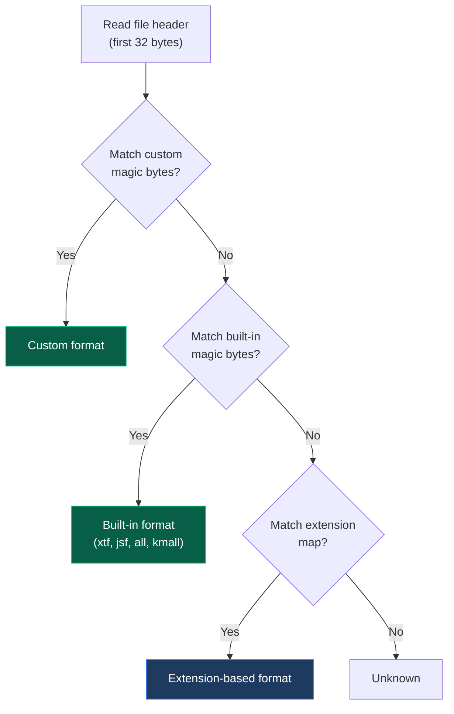

## Detection Methods

Sonar Catalog identifies file formats using two methods:

1. **Magic bytes** — Read the first few bytes of the file and match against known signatures
2. **File extension** — Fall back to extension-based detection

Magic byte detection takes priority. If a file has a `.xtf` extension but doesn't contain the XTF magic bytes, the extension-based detection is used as fallback.

## Built-in Formats

| Format | Extensions | Magic Bytes | Offset | Description |
|---|---|---|---|---|
| XTF | `.xtf` | `0x01 0x00` | 0 | eXtended Triton Format (sidescan, bathymetry) |
| JSF | `.jsf` | `0x16 0x16` | 0 | EdgeTech sonar format |
| Kongsberg ALL | `.all` | `0x49` | 0 | Kongsberg multibeam raw format |
| Kongsberg KMALL | `.kmall` | `0x4B 0x4D` | 0 | Kongsberg modern multibeam format |
| Reson S7K | `.s7k` | — | — | Reson/Teledyne multibeam format |
| BAG | `.bag` | — | — | Bathymetric Attributed Grid (HDF5-based) |
| SEG-Y | `.sgy`, `.segy` | — | — | Seismic / sub-bottom profiler |
| Humminbird | `.db` | — | — | Humminbird consumer sonar |
| Lowrance | `.sl2`, `.sl3` | — | — | Lowrance consumer sonar |
| Garmin | `.son` | — | — | Garmin sonar |
| Raw | `.raw` | — | — | Generic raw sonar data |
| GeoTIFF | `.tif`, `.tiff` | — | — | Sidescan mosaics |
| Point Cloud | `.csv`, `.xyz` | — | — | Bathymetry exports |

## Listing Registered Signatures

```bash
sonar-catalog list-magic-bytes
```

Shows all built-in and custom magic byte signatures with their hex values and associated extensions.

## Format Detection Flow



Detection is dispatched through the [plugin hook system](/docs/plugins/hooks/). The `detect_format` hook uses firstresult mode — the first plugin to return a format name wins.

## Adding Custom Formats

See [Custom Formats](/docs/formats/custom/) for adding your own format signatures.
