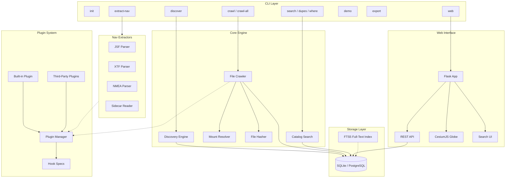
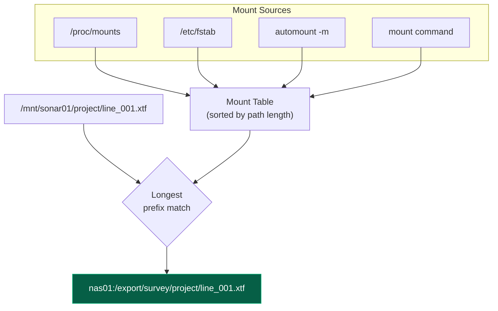
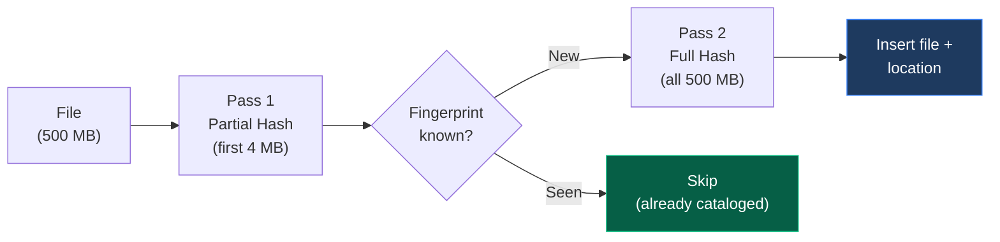
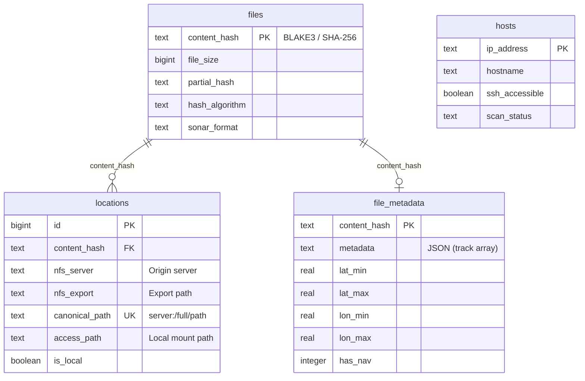
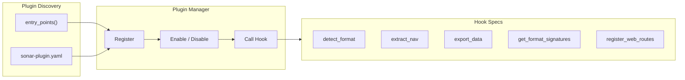

## System Overview

Sonar Catalog is composed of six subsystems that work together to discover, catalog, deduplicate, and visualize sonar files across distributed NFS storage.

## Core Components

### Discovery Engine (`discovery.py`)

Finds NFS servers on the network using multiple methods, each with different coverage and intrusiveness:

| Method | Source | Coverage | Notes |
|---|---|---|---|
| autofs maps | `automount -m` or `/etc/auto.master` | High | Primary method — reads fully resolved maps |
| showmount | `showmount -e <server>` | Medium | Enumerates NFS exports from known servers |
| ip neigh | ARP neighbor table | Medium | Discovers hosts on the local network |
| Subnet scan | TCP port 22 probe | Broad | Optional, more aggressive |

All discovered hosts are validated via SSH probe before crawling.

### Mount Resolver (`mount_resolver.py`)

Translates local mount paths to canonical NFS origins by cross-referencing:

The **longest prefix match** ensures that nested mounts resolve correctly. For example, `/auto/nfs/sonar01/data/file.xtf` matches `/auto/nfs/sonar01` (more specific) over `/auto/nfs` (less specific).

### File Hasher (`hasher.py`)

Uses a two-pass strategy to minimize I/O:

Pass 1 reads only the first 4MB to compute a partial fingerprint. If the fingerprint is already known, the full file is never read. On incremental scans of a typical NFS share with 80% unchanged files, this skips reading ~80% of bytes.

### File Crawler (`crawler.py`)

Orchestrates the full crawl pipeline:

1. Walk the filesystem tree, applying filters (extensions, size, exclude dirs)
2. Batch files for parallel hashing
3. Resolve NFS origins for each file
4. Detect sonar format (via plugin hooks or built-in magic bytes)
5. Extract navigation tracks (if enabled)
6. Batch insert into the database with checkpoint saves

### Catalog Search (`search.py`)

Provides the query interface with FTS5 full-text search on filenames, plus filters for server, format, size range, and content hash lookup.

## Data Model

**Key concept:** No data is copied. The catalog stores *pointers*. One row in `files` per unique content hash, and one row in `locations` per place the file is accessible. If the same file exists on 10 NFS mounts, there's 1 file record and 10 location records.

## Plugin Architecture

The plugin system is modeled after [napari](https://github.com/napari/napari). Built-in functionality (format detection, nav extraction, export) goes through the same hook system as third-party plugins.

See [Plugin System](../plugins/overview/) for the full reference.
