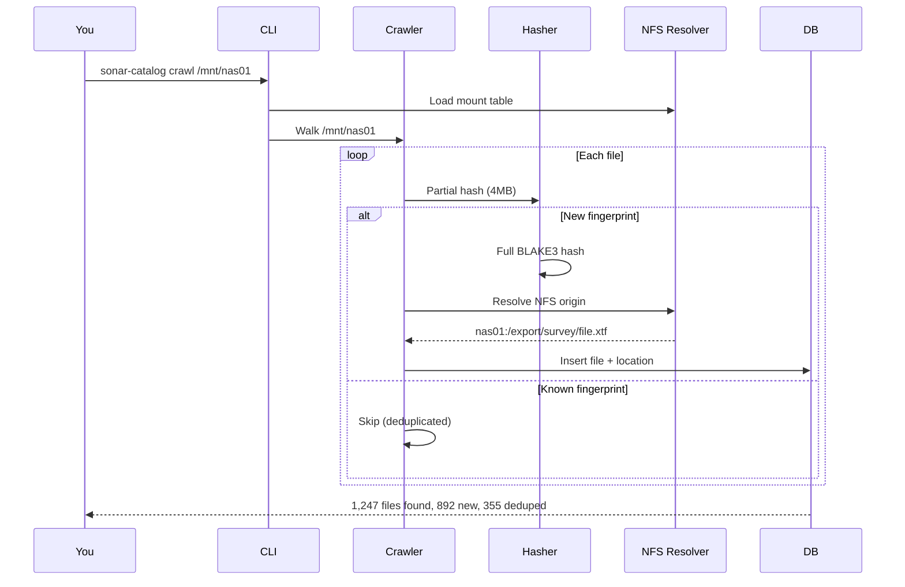

## Install

```bash
# Minimal install (SQLite, stdlib only)
pip install .

# Or with all optional features
pip install ".[all]"
```

## Initialize

```bash
sonar-catalog init
```

This creates the SQLite database at `~/.local/share/sonar-catalog/catalog.db` and writes a default config to `~/.config/sonar-catalog/config.json`.

## Catalog Some Files

**Option A: Crawl a real directory**

```bash
sonar-catalog crawl /mnt/sonar-nas-01
```

**Option B: Load synthetic demo data**

```bash
sonar-catalog demo --num-files 100
```

The demo command generates realistic synthetic sonar files with navigation tracks across 8 global survey regions, spread across 4 simulated NFS servers.

## Explore

```bash
# Catalog statistics
sonar-catalog stats

# Search by filename
sonar-catalog search "line_001"

# Find duplicates across servers
sonar-catalog dupes

# Where is a specific file?
sonar-catalog where <content_hash>
```

## Start the Web UI

```bash
pip install ".[web]"  # if not already installed
sonar-catalog web --port 8080
```

Open your browser:
- **http://localhost:8080** — Search interface with stats dashboard
- **http://localhost:8080/globe** — CesiumJS 3D globe with survey tracks

## Full Discovery Mode

On a network with NFS servers:

```bash
# Discover all NFS hosts automatically
sonar-catalog discover --deep

# Crawl every discovered mount
sonar-catalog crawl-all
```

## What Happens Under the Hood


