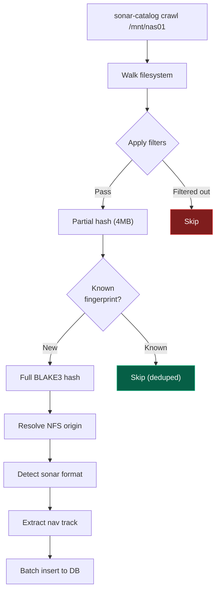

## Basic Crawl

```bash
sonar-catalog crawl /mnt/sonar-nas-01
```

This walks the directory tree, hashes each file, resolves its NFS origin, detects sonar format, and inserts everything into the catalog.

## What Happens During a Crawl



## Specifying Host Info

If the path isn't on an NFS mount (or mount resolution fails), you can manually specify the host:

```bash
sonar-catalog crawl /data/survey --host sonar-server-01 --ip 192.168.1.10
```

## Crawl All Discovered Hosts

Combine discovery and crawling in one step:

```bash
sonar-catalog crawl-all
```

This runs the full discovery engine, then crawls every accessible NFS mount.

## Incremental Scanning

By default, `incremental` mode is enabled. On subsequent crawls, files whose mtime and size haven't changed are skipped entirely — no hashing needed.

Disable for a full rescan:

```json
{
  "crawler": {
    "incremental": false
  }
}
```

## File Filters

### By extension

Only crawl specific file types:

```json
{
  "crawler": {
    "include_extensions": [".xtf", ".jsf", ".s7k", ".all", ".kmall"]
  }
}
```

### By size

```json
{
  "crawler": {
    "min_file_size": 1024,
    "max_file_size": 10737418240
  }
}
```

### Exclude directories

```json
{
  "crawler": {
    "exclude_dirs": [".git", ".svn", "__pycache__", ".Trash", "lost+found"]
  }
}
```

## Performance Tuning

| Setting | Default | Description |
|---|---|---|
| `hash_workers` | `4` | Parallel hashing threads |
| `batch_size` | `1000` | Files per DB batch insert |
| `partial_hash_size` | `4194304` | Bytes for partial fingerprint (4MB) |
| `checkpoint_interval` | `5000` | Files between checkpoint saves |

For large NFS shares (millions of files), increase `batch_size` and `checkpoint_interval`:

```json
{
  "crawler": {
    "batch_size": 5000,
    "checkpoint_interval": 25000,
    "hash_workers": 8
  }
}
```
