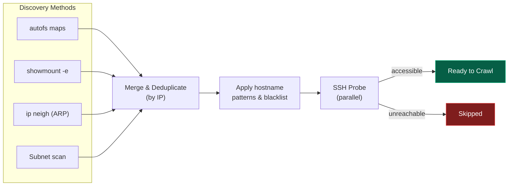

## Running Discovery

```bash
# Standard discovery
sonar-catalog discover

# Deep discovery (SSH into hosts to find remote mounts)
sonar-catalog discover --deep
```

## Discovery Methods



### 1. Autofs Maps (primary)

Parses fully resolved autofs maps from `automount -m`. Falls back to reading `/etc/auto.master` and referenced map files directly.

```bash
# What sonar-catalog reads:
automount -m
# Output like: /auto/nfs/sonar01  server1:/export/data
```

### 2. Showmount

Queries known NFS servers for their exports:

```bash
showmount -e sonar-server-01
# /export/survey  (everyone)
# /export/data    192.168.1.0/24
```

### 3. IP Neighbor (ARP)

Reads the kernel ARP table to find recently-contacted hosts:

```bash
ip neigh
# 192.168.1.10 dev eth0 lladdr aa:bb:cc:dd:ee:ff REACHABLE
```

### 4. Subnet Scan (optional)

Probes TCP port 22 across configured subnets. Disabled by default — enable in config:

```json
{
  "discovery": {
    "use_subnet_scan": true,
    "scan_subnets": ["192.168.1.0/24", "10.0.0.0/16"]
  }
}
```

## Filtering Hosts

### Hostname patterns

Only discover hosts matching glob patterns:

```json
{
  "discovery": {
    "hostname_patterns": ["sonar-*", "nas-*", "ss-*"]
  }
}
```

### Blacklist

Never discover or crawl these hosts:

```json
{
  "discovery": {
    "host_blacklist": ["192.168.1.1", "gateway"]
  }
}
```

### Whitelist

Only these hosts are allowed (overrides pattern matching):

```json
{
  "discovery": {
    "host_whitelist": ["sonar-01", "sonar-02", "nas-backup"]
  }
}
```

## SSH Configuration

| Field | Default | Description |
|---|---|---|
| `ssh_user` | `"xyz"` | Username for SSH probes |
| `ssh_timeout` | `3` | Connection timeout (seconds) |
| `ssh_auth_method` | `"key"` | `"key"`, `"sshpass_file"`, or `"sshpass_env"` |
| `ssh_key_path` | `null` | Path to SSH private key (uses ssh-agent if null) |
| `ssh_host_key_policy` | `"accept-new"` | `"accept-new"`, `"no"`, or `"yes"` |

## Deep Discovery

With `--deep`, the discovery engine SSHes into each accessible host and runs mount discovery remotely — finding NFS mounts that aren't visible from the local machine.

```bash
sonar-catalog discover --deep
```

## Listing Discovered Hosts

```bash
sonar-catalog hosts
sonar-catalog hosts --output json
```
