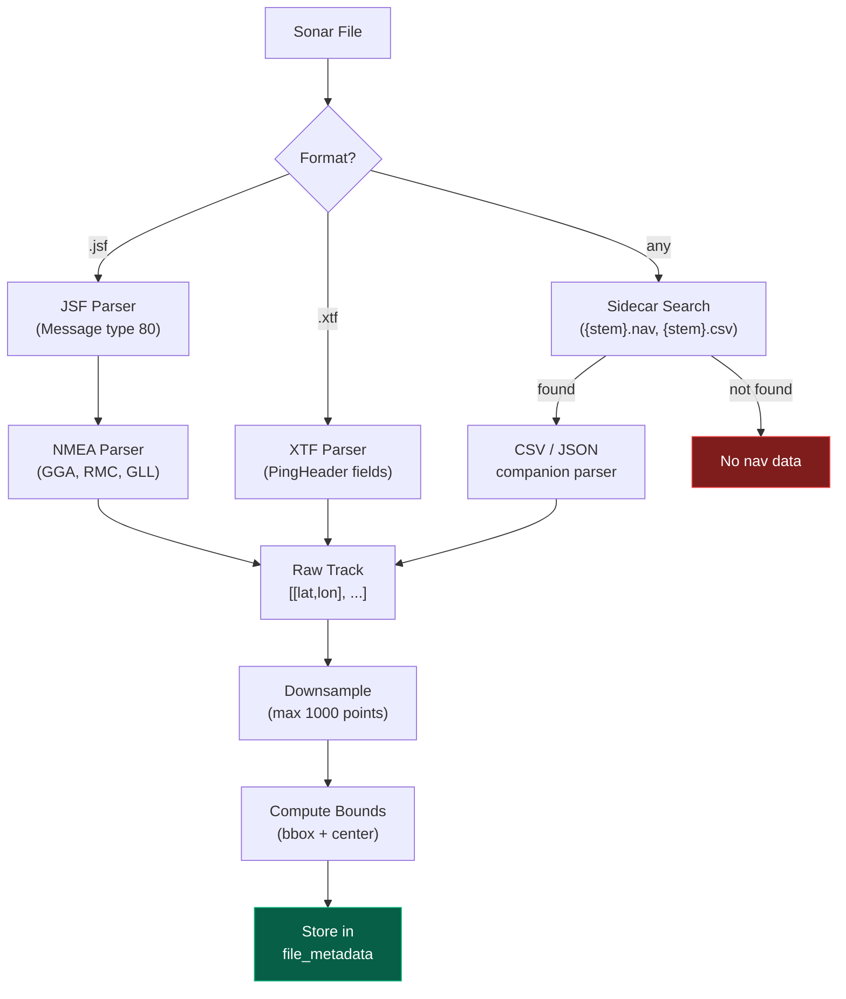

## Overview

Sonar Catalog can extract geographic navigation tracks from sonar files — either by parsing binary nav packets directly from JSF/XTF files, or by reading companion sidecar files (CSV, JSON).

Extracted tracks are stored with bounding boxes for spatial queries and rendered on the CesiumJS globe.

## Automatic Extraction During Crawl

Nav extraction runs automatically during `sonar-catalog crawl` when enabled (default):

```json
{
  "metadata": {
    "nav_extraction": {
      "enabled": true,
      "max_track_points": 1000,
      "extract_from_binary": true
    }
  }
}
```

## Retroactive Extraction

Extract nav data from files already in the catalog:

```bash
# All files without nav data
sonar-catalog extract-nav

# Only JSF files
sonar-catalog extract-nav --format jsf

# A single file
sonar-catalog extract-nav --hash abc123...

# Re-extract even if data exists
sonar-catalog extract-nav --force
```

## Extraction Pipeline



## Built-in Extractors

### JSF (EdgeTech)

Streams through JSF messages looking for type 80 (NMEA navigation data). Parses NMEA sentences (GGA, RMC, GLL) to extract latitude and longitude.

JSF file structure:
```
[0x1601 marker][16-byte header][message data]
[0x1601 marker][16-byte header][message data]
...
```

### XTF (eXtended Triton Format)

Reads PingHeader packets (type 0) after the 1024-byte file header. Each PingHeader contains `SensorXcoord` and `SensorYcoord` as float64 lat/lon values.

XTF file structure:
```
[1024-byte file header]
[0xFACE][PingHeader with lat/lon]
[0xFACE][PingHeader with lat/lon]
...
```

### NMEA Parser (shared)

Parses standard NMEA-0183 sentences used by both JSF and standalone nav files:

| Sentence | Fields | Example |
|---|---|---|
| `$GPGGA` | Lat, lon, fix quality, altitude | Primary GPS fix |
| `$GPRMC` | Lat, lon, speed, course, date | Recommended minimum |
| `$GPGLL` | Lat, lon, time, status | Geographic position |

## Sidecar Files

Many survey workflows produce companion navigation files alongside the sonar data. Configure patterns to read them:

```json
{
  "metadata": {
    "nav_extraction": {
      "sidecar_patterns": [
        {
          "pattern": "{stem}.nav",
          "format": "csv",
          "lat_field": "lat",
          "lon_field": "lon",
          "delimiter": ","
        },
        {
          "pattern": "{stem}_nav.json",
          "format": "json",
          "lat_field": "latitude",
          "lon_field": "longitude"
        }
      ]
    }
  }
}
```

The `{stem}` placeholder expands to the filename without extension. So for `line_001.xtf`, it looks for `line_001.nav`.

### CSV format

```csv
lat,lon
56.123,3.456
56.124,3.457
56.125,3.458
```

### JSON format

```json
[
  {"latitude": 56.123, "longitude": 3.456},
  {"latitude": 56.124, "longitude": 3.457}
]
```

## Track Downsampling

Tracks are downsampled to `max_track_points` (default 1000) using uniform sampling that preserves the first and last points. This keeps storage and rendering efficient even for files with millions of nav fixes.

## Plugin Extension

Custom nav extractors can be added via the plugin system. See [Writing a Plugin](../plugins/writing-a-plugin/) for details on implementing the `extract_nav` hook.
