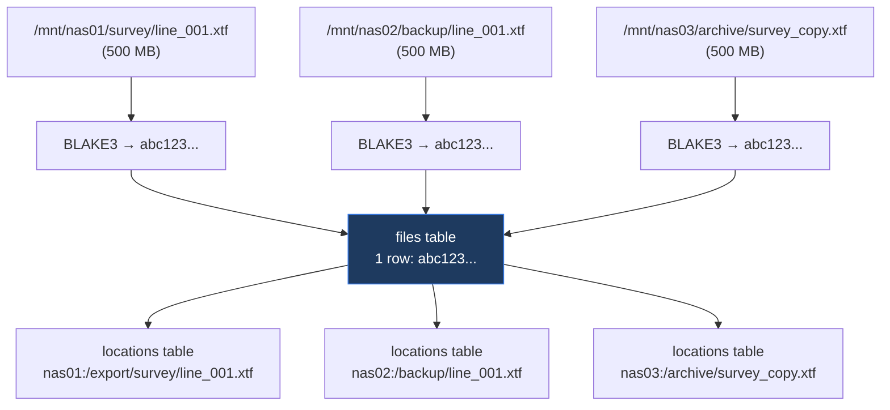

## Full-Text Search

```bash
sonar-catalog search "line_001"
sonar-catalog search "*.xtf" --format xtf
sonar-catalog search --server sonar-nas-01
sonar-catalog search --min-size 1GB --max-size 10GB
```

The search uses SQLite FTS5 for fast filename matching. Queries match against file names with tokenized search.

## Output Formats

```bash
# Human-readable table (default)
sonar-catalog search "survey"

# JSON output for scripting
sonar-catalog search "survey" --output json

# Limit results
sonar-catalog search "survey" --limit 50
```

## Finding Duplicates

```bash
# Find all files that exist in multiple locations
sonar-catalog dupes

# JSON output
sonar-catalog dupes --output json

# Only show files duplicated 3+ times
sonar-catalog dupes --min-count 3
```

Duplicates are identified by content hash — two files with the same BLAKE3 hash are byte-for-byte identical, regardless of filename or location.

## Where Is a File?

Given a content hash, show every location where the file exists:

```bash
sonar-catalog where abc123def456...
```

Output shows all canonical paths and access paths for the file.

## Statistics

```bash
sonar-catalog stats
```

```
=== Sonar Catalog Statistics ===

  Unique files:      12,847
  Total locations:   19,283
  Unique data size:  4.2 TB
  Dedup ratio:       1.5x

  NFS servers:       8
  NFS locations:     19,283
  Local locations:   0

  Sonar formats:     6
```

## How Deduplication Works



Three copies of the same file on three servers produce **1 file record** and **3 location records**. The dedup ratio tells you how much redundancy exists across your NFS infrastructure.

## Web Search

The web interface at `http://localhost:8080` provides the same search with a graphical UI, including:

- Real-time search with type-ahead
- Server and format dropdown filters
- Size range filtering
- Click-through to file details and all locations
