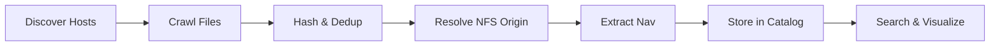

Sonar Catalog discovers, catalogs, and deduplicates sonar files scattered across distributed NFS storage. It resolves mount topologies to establish canonical file identities, extracts navigation tracks from binary sonar formats, and serves everything through a searchable web interface with a CesiumJS 3D globe.

## What It Does

- **Content-based deduplication** — BLAKE3 hashing identifies identical files regardless of where they're mounted
- **NFS topology resolution** — Translates local mount paths to canonical `server:/export/path` identities
- **Automatic host discovery** — Finds NFS servers via autofs, showmount, ARP tables, and subnet scans
- **Navigation extraction** — Parses lat/lon tracks from JSF, XTF, and companion sidecar files
- **Full-text search** — FTS5-powered filename search with server and format filters
- **3D visualization** — CesiumJS globe shows file locations and survey tracks
- **Plugin architecture** — Extend format detection, nav extraction, and export via Python entry points

## Quick Example

```bash
# Initialize the database
sonar-catalog init

# Crawl a mounted NFS share
sonar-catalog crawl /mnt/sonar-nas-01

# Or load demo data to explore
sonar-catalog demo --num-files 100

# Start the web UI
sonar-catalog web --port 8080
```

## Zero Dependencies

The core runs on Python 3.10+ standard library only. SQLite is the default database. Optional extras add BLAKE3 hashing, PostgreSQL, Flask web UI, and python-magic MIME detection.

## How It Works



1. **Discover** — Find NFS servers on the network via autofs maps, showmount, ARP tables
2. **Crawl** — Walk directory trees, applying size and extension filters
3. **Hash** — Two-pass BLAKE3: partial hash (4MB) to fingerprint, full hash only for new files
4. **Resolve** — Cross-reference `/proc/mounts`, fstab, and autofs to find the canonical NFS origin
5. **Extract** — Parse binary nav packets (JSF/XTF) or read sidecar CSV/JSON files
6. **Store** — Batch insert into SQLite/PostgreSQL with bounding box indexes
7. **Search** — Full-text search, duplicate detection, and geographic queries via web UI

## Next Steps

- [Quickstart](/docs/getting-started/quickstart/) — Get running in 2 minutes
- [Architecture](/docs/getting-started/architecture/) — Understand the system design
- [CLI Reference](/docs/reference/cli/) — All 18 commands
- [Plugin System](/docs/plugins/overview/) — Extend with custom formats
