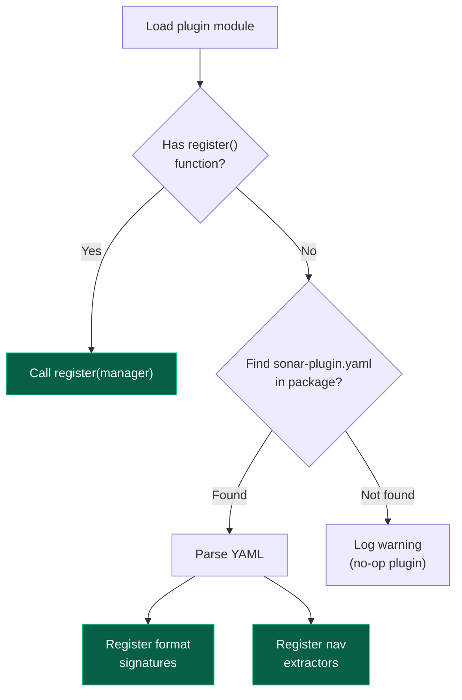

## Overview

Instead of (or in addition to) a `register()` function, plugins can declare their capabilities via a `sonar-plugin.yaml` manifest file. This is useful for simple format additions that don't need custom logic.

## Manifest Location

Place `sonar-plugin.yaml` in your plugin package root:

```
my_sonar_plugin/
    __init__.py
    sonar-plugin.yaml
```

## Format

```yaml
name: my-sonar-plugin
version: 1.0.0
description: Adds FooBar sonar format support

contributions:
  formats:
    - name: foobar
      extensions: [".fb", ".fbar"]
      magic_bytes: "f00bar"
      magic_offset: 0

  nav_extractors:
    - format: foobar
      python_name: my_sonar_plugin.extractors:FooBarExtractor
```

## Fields

### Top-level

| Field | Required | Description |
|---|---|---|
| `name` | Yes | Plugin name (must match entry point name) |
| `version` | Yes | Semantic version |
| `description` | No | Human-readable description |

### contributions.formats

Each entry adds a sonar format:

| Field | Required | Description |
|---|---|---|
| `name` | Yes | Format identifier (e.g., `"foobar"`) |
| `extensions` | No | File extensions (e.g., `[".fb", ".fbar"]`) |
| `magic_bytes` | No | Hex-encoded magic bytes |
| `magic_offset` | No | Byte offset for magic bytes (default: 0) |

### contributions.nav_extractors

Each entry registers a navigation extractor:

| Field | Required | Description |
|---|---|---|
| `format` | Yes | Format this extractor handles |
| `python_name` | Yes | Importable path to the extractor class (`module:ClassName`) |

The class must extend `sonar_catalog.extractors.base.NavExtractor`:

```python
from sonar_catalog.extractors.base import NavExtractor, NavResult

class FooBarExtractor(NavExtractor):
    supported_formats = ["foobar"]

    def extract(self, file_path, sonar_format=None):
        # Parse the file...
        track = [[56.0, 3.0], [56.1, 3.1]]
        return NavResult(track=track, source="foobar_extractor")
```

## How It Works

When a plugin module doesn't have a `register()` function, the plugin manager looks for `sonar-plugin.yaml` inside the package and auto-registers the declared contributions:



## Combining Manifest and Code

You can use both. The `register()` function runs first (for complex logic), and the manifest provides additional declarative contributions. This is useful when you have some formats that are simple signature matches and others that need custom detection code.
