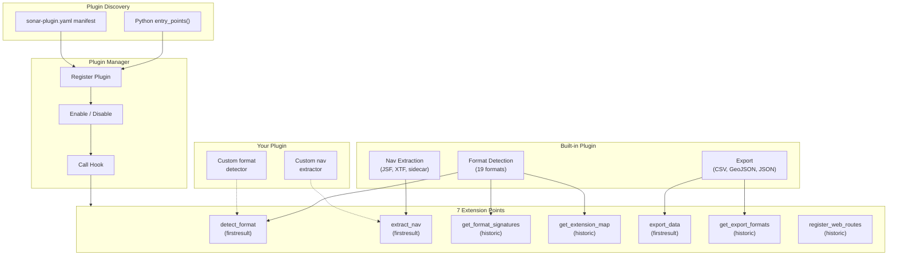

## Design

The plugin system is modeled after [napari](https://github.com/napari/napari)'s architecture. All built-in functionality — format detection, navigation extraction, data export — is registered through the same hook system that third-party plugins use.

This means:
- Built-in behavior can be overridden by installing a plugin with higher priority
- Third-party plugins have the same capabilities as built-in code
- Plugins can be enabled/disabled at runtime without code changes

## Architecture



## Hook Modes

| Mode | Behavior | Used By |
|---|---|---|
| **firstresult** | First plugin to return non-`None` wins. Short-circuits — later plugins are never called. | `detect_format`, `extract_nav`, `export_data` |
| **historic** | All plugins contribute results. Returns a list of all non-None results. | `get_format_signatures`, `get_extension_map`, `get_export_formats`, `register_web_routes` |

## Managing Plugins

### List installed plugins

```bash
sonar-catalog plugins list
```

```
Plugin                    Version    Status     Hooks
----------------------------------------------------------------------
builtin                   1.0.0      enabled    get_format_signatures, ...
my-sonar-plugin           0.3.0      enabled    detect_format, extract_nav
```

### Disable a plugin

```bash
sonar-catalog plugins disable my-sonar-plugin
```

Or in config:

```json
{
  "plugins": {
    "disabled_plugins": ["my-sonar-plugin"]
  }
}
```

### Enable a plugin

```bash
sonar-catalog plugins enable my-sonar-plugin
```

## Plugin Priority

Hooks are called in priority order (lower number = called first, default = 100). A plugin can set a lower priority to override built-in behavior:

```python
manager.register_hook_impl(
    "detect_format", "my-plugin", my_detect_fn,
    priority=50,  # called before built-in (priority 100)
)
```

## Next Steps

- [Writing a Plugin](/docs/plugins/writing-a-plugin/) — Create your first plugin
- [Hook Reference](/docs/plugins/hooks/) — All 7 extension points with signatures
- [Manifest Format](/docs/plugins/manifest/) — Declarative YAML alternative to code
