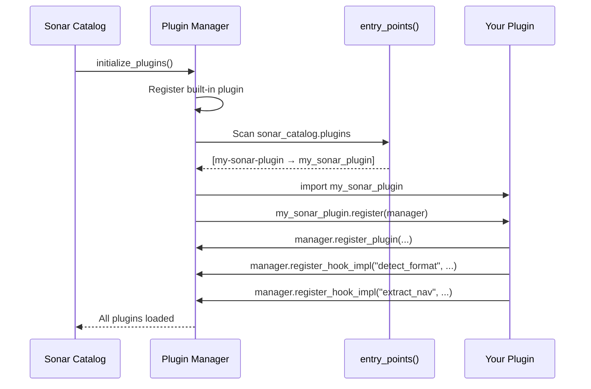

## Minimal Plugin

A plugin is a Python package with an entry point and a `register()` function.

### 1. Create the package

```
my-sonar-plugin/
    pyproject.toml
    my_sonar_plugin/
        __init__.py
```

### 2. Declare the entry point

```toml
# pyproject.toml
[project]
name = "my-sonar-plugin"
version = "1.0.0"

[project.entry-points."sonar_catalog.plugins"]
my-sonar-plugin = "my_sonar_plugin"
```

The key `"sonar_catalog.plugins"` is the entry point group that Sonar Catalog scans during initialization.

### 3. Implement the register function

```python
# my_sonar_plugin/__init__.py

__version__ = "1.0.0"

def register(manager):
    """Called by Sonar Catalog when the plugin is loaded."""
    manager.register_plugin(
        name="my-sonar-plugin",
        version=__version__,
        description="Adds FooBar sonar format support",
    )

    # Register hook implementations
    manager.register_hook_impl(
        "detect_format", "my-sonar-plugin", detect_foobar
    )
    manager.register_hook_impl(
        "get_format_signatures", "my-sonar-plugin", get_signatures
    )
    manager.register_hook_impl(
        "extract_nav", "my-sonar-plugin", extract_foobar_nav
    )
```

### 4. Implement the hooks

```python
def detect_foobar(file_path=None, header=None, extension=None, **kwargs):
    """Detect FooBar format from magic bytes."""
    if header and header[:4] == b"\xFO\x0B\xAR":
        return "foobar"
    if extension == ".fb":
        return "foobar"
    return None  # Not our format — let other plugins try


def get_signatures(**kwargs):
    """Contribute our magic byte signatures."""
    return {
        "signatures": [
            {"format": "foobar", "hex_bytes": "f00bar", "byte_length": 3}
        ],
        "extensions": {".fb": "foobar", ".fbar": "foobar"},
    }


def extract_foobar_nav(file_path=None, sonar_format=None, **kwargs):
    """Extract navigation from FooBar files."""
    if sonar_format != "foobar":
        return None  # Not our format

    from sonar_catalog.extractors.base import NavResult

    # Parse the file and extract lat/lon track...
    track = _parse_foobar_nav(file_path)
    if not track:
        return None

    return NavResult(
        track=track,
        source="foobar_nav",
        point_count_original=len(track),
    )


def _parse_foobar_nav(file_path):
    """Parse FooBar binary nav data."""
    track = []
    with open(file_path, "rb") as f:
        f.seek(16)  # skip header
        while True:
            data = f.read(16)
            if len(data) < 16:
                break
            import struct
            lat, lon = struct.unpack("<dd", data)
            if -90 <= lat <= 90 and -180 <= lon <= 180:
                track.append([lat, lon])
    return track
```

### 5. Install and verify

```bash
pip install -e ./my-sonar-plugin
sonar-catalog plugins list
```

```
Plugin                    Version    Status     Hooks
----------------------------------------------------------------------
builtin                   1.0.0      enabled    get_format_signatures, ...
my-sonar-plugin           1.0.0      enabled    detect_format, get_format_signatures, extract_nav
```

## Plugin Lifecycle



## Important Conventions

### Always accept `**kwargs`

Hook functions must accept `**kwargs` to be forward-compatible with new parameters:

```python
# Good
def my_hook(file_path=None, sonar_format=None, **kwargs):
    ...

# Bad — breaks if new params are added
def my_hook(file_path, sonar_format):
    ...
```

### Return `None` to pass

For `firstresult` hooks, return `None` to let other plugins try. Only return a value if you positively handle the case.

### Don't raise exceptions

Hook implementations should catch their own exceptions. The plugin manager logs errors from hooks and continues to the next implementation, but clean error handling is preferred.

## Testing Your Plugin

```python
import pytest
from sonar_catalog.plugins.manager import PluginManager

def test_my_plugin():
    pm = PluginManager()

    # Import and register your plugin
    import my_sonar_plugin
    my_sonar_plugin.register(pm)

    assert "my-sonar-plugin" in pm.plugin_names

    # Test format detection
    result = pm.call_hook(
        "detect_format",
        file_path="/path/to/test.fb",
        header=b"\xFO\x0B\xAR" + b"\x00" * 28,
        extension=".fb",
    )
    assert result == "foobar"
```
