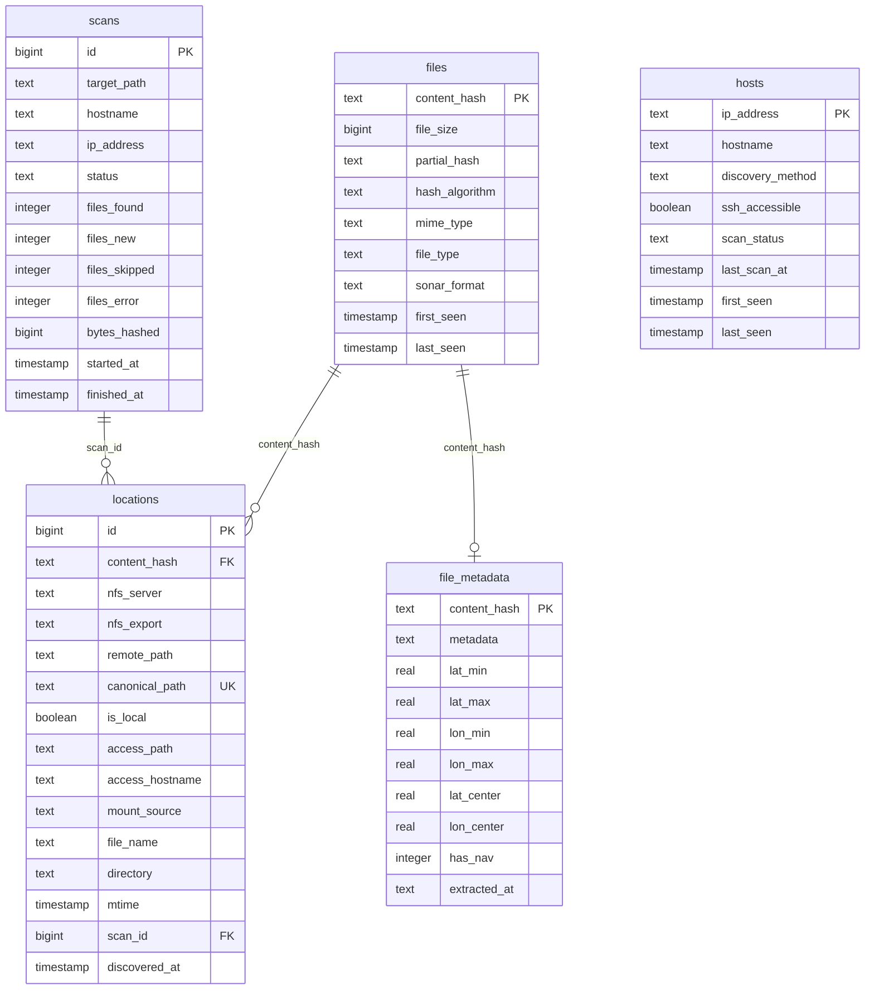

## Overview

Sonar Catalog supports two backends:

| Backend | Use Case | Setup |
|---|---|---|
| **SQLite** (default) | Single-machine, zero-config | Works out of the box |
| **PostgreSQL** | Multi-machine, concurrent access | Requires `pip install ".[postgres]"` |

Both backends use the same schema. SQLite additionally uses FTS5 for full-text search.

## Entity Relationship



## Tables

### files

One row per unique content hash. The single source of truth for file identity.

| Column | Type | Description |
|---|---|---|
| `content_hash` | TEXT PK | BLAKE3 or SHA-256 hash of full file contents |
| `file_size` | BIGINT | File size in bytes |
| `partial_hash` | TEXT | Hash of first `partial_hash_size` bytes (fingerprint) |
| `hash_algorithm` | TEXT | `"blake3"` or `"sha256"` |
| `mime_type` | TEXT | MIME type (if python-magic is available) |
| `file_type` | TEXT | Output of `file` command |
| `sonar_format` | TEXT | Detected sonar format (`"xtf"`, `"jsf"`, etc.) |
| `first_seen` | TIMESTAMP | When this hash was first cataloged |
| `last_seen` | TIMESTAMP | When this hash was last seen |

### locations

Every place a file is accessible. Multiple rows per content hash if the file exists on multiple NFS servers.

| Column | Type | Description |
|---|---|---|
| `id` | BIGINT PK | Auto-increment ID |
| `content_hash` | TEXT FK | References `files.content_hash` |
| `nfs_server` | TEXT | Origin NFS server hostname |
| `nfs_export` | TEXT | Server export path (e.g., `/export/survey`) |
| `remote_path` | TEXT | Full path on the origin server |
| `canonical_path` | TEXT UK | `server:/full/path` — the authoritative pointer |
| `is_local` | BOOLEAN | True if on local disk, not NFS |
| `access_path` | TEXT | Local mount path used to reach the file |
| `access_hostname` | TEXT | Hostname of the machine that crawled this |
| `mount_source` | TEXT | How the mount was resolved (`proc_mounts`, `autofs_map`, `fstab`, `local`) |
| `file_name` | TEXT | Filename only |
| `directory` | TEXT | Parent directory on origin server |

### file_metadata

Extended metadata and navigation data. One row per content hash.

| Column | Type | Description |
|---|---|---|
| `content_hash` | TEXT PK | References `files.content_hash` |
| `metadata` | TEXT | JSON blob containing track array and properties |
| `lat_min`, `lat_max` | REAL | Latitude bounds of nav track |
| `lon_min`, `lon_max` | REAL | Longitude bounds of nav track |
| `lat_center`, `lon_center` | REAL | Track centroid |
| `has_nav` | INTEGER | 1 if nav data extracted, 0 otherwise |

### hosts

Discovered hosts and their scan status.

### scans

Scan history for tracking crawl runs.

## Indexes

```sql
-- Fast lookup by content hash
CREATE INDEX idx_loc_hash ON locations(content_hash);

-- Find files by server
CREATE INDEX idx_loc_server ON locations(nfs_server);

-- Find files by format
CREATE INDEX idx_files_format ON files(sonar_format);

-- Spatial queries on nav data
CREATE INDEX idx_meta_has_nav ON file_metadata(has_nav);
CREATE INDEX idx_meta_bbox ON file_metadata(lat_min, lat_max, lon_min, lon_max);
CREATE INDEX idx_meta_center ON file_metadata(lat_center, lon_center);
```

## FTS5 (SQLite only)

SQLite builds an FTS5 full-text index on filenames for fast search:

```sql
CREATE VIRTUAL TABLE IF NOT EXISTS files_fts USING fts5(
    file_name, content_hash, content='', tokenize='unicode61'
);
```

Rebuild with:

```bash
sonar-catalog rebuild-index
```

## Switching to PostgreSQL

```json
{
  "database": {
    "backend": "postgresql",
    "pg_host": "db.example.com",
    "pg_port": 5432,
    "pg_database": "sonar_catalog",
    "pg_user": "sonar_catalog",
    "pg_password": "secret"
  }
}
```

Requires: `pip install ".[postgres]"`
