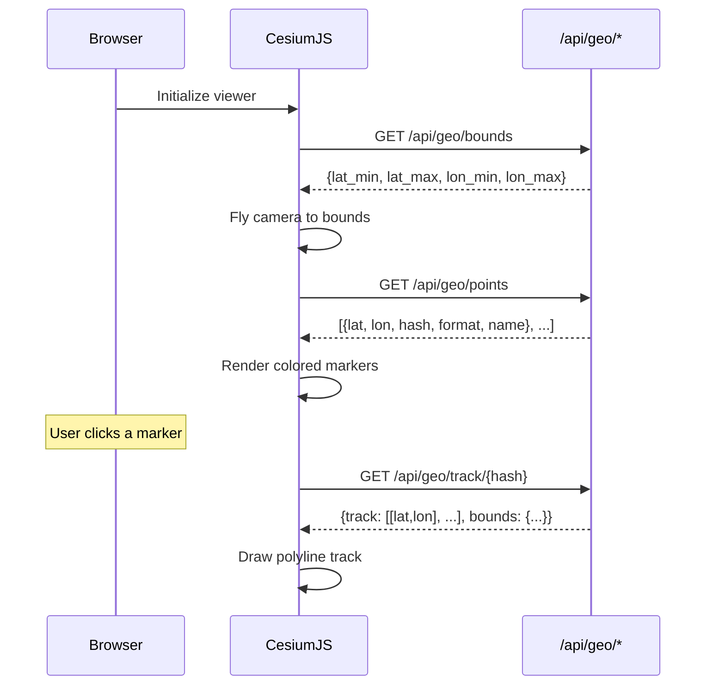

## Overview

The globe view renders sonar file locations as color-coded markers on a CesiumJS 3D globe. Clicking a marker loads and displays the file's navigation track as a polyline.

**URL:** http://localhost:8080/globe

## Features

### Color-Coded Markers

Files are displayed as colored points based on their sonar format:

| Color | Format |
|---|---|
| Cyan | XTF |
| Orange | JSF |
| Green | S7K |
| Yellow | KMALL |
| Red | ALL |
| Purple | BAG |
| White | Other |

### Track Visualization

Click any marker to load the file's navigation track. The track renders as a glowing polyline showing the survey path.

### Format Filter

Use the dropdown to show/hide markers by sonar format. The point count updates in real-time.

### Camera Fly-To

On load, the globe queries `/api/geo/bounds` to determine the extent of all nav data and flies the camera to frame it.

## How It Works



## API Endpoints

The globe uses three API endpoints:

| Endpoint | Description |
|---|---|
| `GET /api/geo/points` | All file center points with format and name |
| `GET /api/geo/track/<hash>` | Full nav track for a specific file |
| `GET /api/geo/bounds` | Overall geographic extent of all nav data |

### Query Parameters for /api/geo/points

| Parameter | Type | Description |
|---|---|---|
| `lat_min` | float | Southern bound |
| `lat_max` | float | Northern bound |
| `lon_min` | float | Western bound |
| `lon_max` | float | Eastern bound |
| `format` | string | Filter by sonar format |
| `limit` | int | Max points to return (default: 10000) |

## Requirements

- The `web` extra must be installed: `pip install ".[web]"`
- CesiumJS is loaded from CDN (requires internet access)
- Files must have nav data extracted (run `sonar-catalog extract-nav` or use demo data)

## Demo

```bash
sonar-catalog init
sonar-catalog demo --num-files 100
sonar-catalog web --port 8080
# Open http://localhost:8080/globe
```
