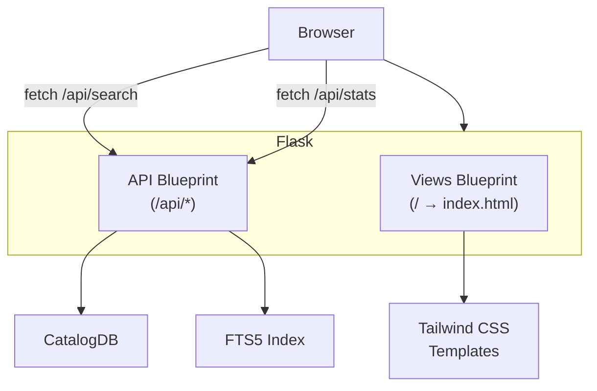

## Starting the Web UI

```bash
pip install ".[web]"  # if not already installed
sonar-catalog web --port 8080
```

Open **http://localhost:8080** in your browser.

## Features

### Full-Text Search

Type in the search box to find files by name. Uses SQLite FTS5 for fast tokenized matching — searching "line_001" finds `survey_line_001.xtf`, `line_001_processed.jsf`, etc.

### Filter Dropdowns

- **Server** — Filter by NFS server (populated from catalog data)
- **Format** — Filter by sonar format (xtf, jsf, s7k, etc.)

### Stats Dashboard

The home page shows catalog statistics:

- Total unique files and locations
- Unique data size with dedup ratio
- NFS server count
- Sonar format breakdown

### File Detail

Click a file to see:

- Content hash, size, format, MIME type
- All locations (every NFS server where the file exists)
- Canonical path for each location

## Configuration

```bash
# Custom host and port
sonar-catalog web --host 0.0.0.0 --port 9090

# Debug mode (auto-reload on code changes)
sonar-catalog web --debug
```

:::caution
Do not use `--host 0.0.0.0` in production without proper authentication. The web interface has no built-in auth.
:::

## Architecture



The frontend is server-rendered HTML with Tailwind CSS, plus vanilla JavaScript for search interactions. API calls go to `/api/search`, `/api/stats`, etc.
